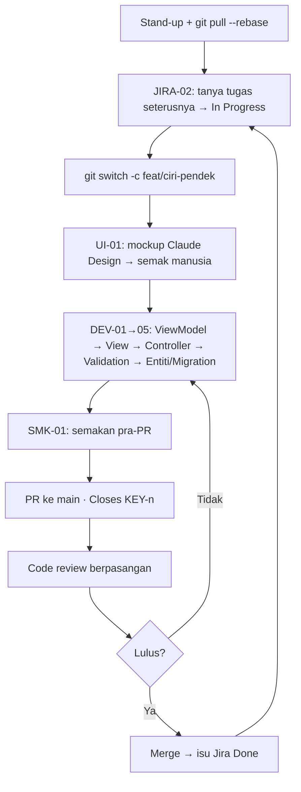

# Aliran Harian & Gambaran Keseluruhan — Fasa 2 (Hari 4–14)

> **Satu halaman** untuk faham **keseluruhan plan** dan **amalan harian**. Setiap hari anda ulang **kitaran satu tugas** yang sama — dari tanya Jira sampai merge. Kuasai kitaran ini, dan 11 hari trek jadi rutin, bukan huru-hara.

---

## 1. Gambaran keseluruhan (15 hari, ringkas)

| Fasa | Hari | Apa berlaku |
|------|------|-------------|
| **1 · Bersama** | 1–3 | Perancangan · URS/ERD · Git/Agile/kolaborasi · refresher .NET + kontrak Profile DB |
| **2 · 4 trek selari** | 4–14 | Setiap kumpulan bina modulnya (repo sendiri), blok demi blok — **kitaran satu tugas** setiap hari |
| **3 · Bersama** | 15 | Integrasi rentas sistem via **Profile DB**, Papan Pemuka Induk, SIT/UAT, demo |

> Plan penuh: [`../JADUAL.md`](../JADUAL.md) · kanun: [`../SPEC-KURSUS.md`](../SPEC-KURSUS.md) · kontrak pasukan: [`../KOLABORASI.md`](../KOLABORASI.md).

---

## 2. Rentak harian (Hari 4–14)

| Masa | Aktiviti |
|------|----------|
| 9.00 – 9.15 | **Stand-up** — semalam / hari ini / halangan. `git pull --rebase` dalam repo anda. |
| 9.15 – 9.25 | **Semakan silang** — konsistensi konvensyen & kontrak Profile DB (KOLABORASI §7). |
| 9.25 – 1.00 | Pembangunan (commit kecil & kerap) |
| 2.30 – 4.30 | Pembangunan |
| 4.30 – 5.00 | **Code review berpasangan** + PR ke `main` + push + kemas kini board |

---

## 3. Kitaran satu tugas (ulang setiap tugas)

**Langkah demi langkah** (rujuk [`AGENTS.md`](../AGENTS.md) → *Aliran kerja setiap tugas*):

1. **Tanya Jira** tugas seterusnya → sahkan skop & AC → **In Progress**.
2. **Cabang baharu** `feat/<ciri-pendek>` — satu tugas = satu cabang.
3. **Mockup dahulu** (Claude Design via MCP) → semak sebelum kod.
4. **Bina form-first** — DEV-01→05, guna mockup sebagai rujukan View.
5. **Semakan pra-PR** (SMK-01) → betulkan sendiri.
6. **PR ke `main`** (`Closes <KEY>-n`, templat KOLABORASI §10).
7. **Review → merge → Jira Done.** Ulang.

---

## 4. Prompt untuk setiap langkah

| Langkah | Prompt | Fail |
|---------|--------|------|
| Tugas seterusnya | **JIRA-02** | [`pustaka-prompt.md`](./pustaka-prompt.md) |
| Reka mockup | **UI-01** (Claude Design MCP) | ↑ |
| Bina borang | **DEV-01 → DEV-05** | ↑ · [`mula-claude-code-borang-dahulu.md`](./mula-claude-code-borang-dahulu.md) |
| Aliran kelulusan (Hari 7–9) | **DEV-06** | ↑ |
| Ujian (Hari 13–14) | **DEV-07** | ↑ |
| Semakan pra-PR | **SMK-01** | ↑ |
| Cipta isu dari user story | **JIRA-01** | ↑ |

> MCP (Jira + Claude Design + FigJam): [`lab-mcp-jira-figjam.md`](./lab-mcp-jira-figjam.md).

---

## 5. Bila tugas "selesai"? (Definition of Done)

Ringkas — senarai penuh di [`../KOLABORASI.md`](../KOLABORASI.md) §9:

- [ ] `dotnet build` bersih; ciri berfungsi manual.
- [ ] Guna komponen piawai; tiada logik didup dalam repo.
- [ ] Data pengguna via **Profile DB**; validation di **pelayan**; `[Authorize(Roles=…)]` betul.
- [ ] Kod jana-AI **difahami & boleh diterangkan** oleh penulisnya.
- [ ] PR ada perihalan BM + cara uji; diluluskan seorang rakan.
- [ ] Isu board dipindah ke **Done**.

---

## 6. Amalan harian (cadangan)

- **Mula hari** dengan stand-up + `git pull --rebase` + **JIRA-02** (jangan teka tugas).
- **1–3 tugas kecil** sehari; **satu cabang setiap tugas** — jangan campur ciri.
- **Commit kecil & kerap**; buka **PR sebelum 5pm**; kemas board.
- **Semakan silang harian** (KOLABORASI §7) — konvensyen & kontrak Profile DB.
- **AI = pembantu, anda sahkan.** Setiap draf disemak; tiada commit tanpa faham.
- **Refleksi hujung hari:** apa tersekat? Di mana? Bawa ke stand-up esok.

---

> **Titik pengajaran:** disiplin kitaran ini (Jira → cabang → mockup → bina → PR → Done) yang membuatkan **integrasi Hari 15 membosankan** — dan itu matlamatnya.
