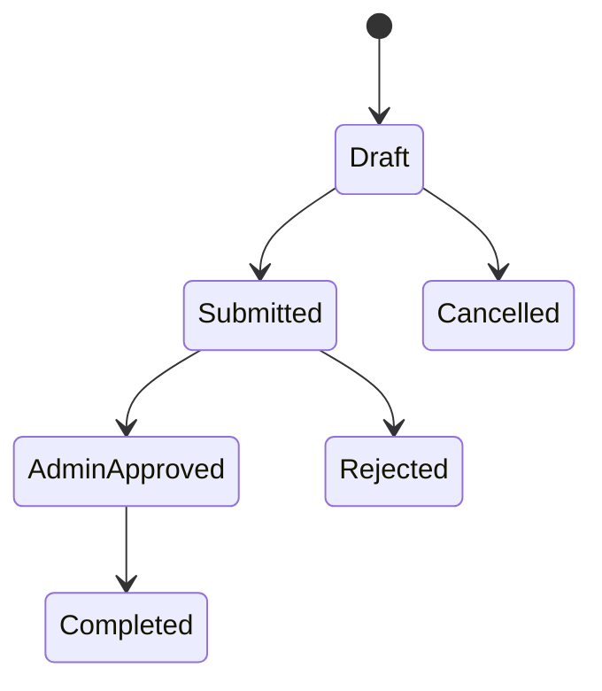

# Cara jana dokumentasi & diagram (Mermaid) dengan AI

> **Bahan rujukan kursus (Hari 2 · Claude Code).** Dua kaedah untuk menghasilkan dokumentasi modul + diagram Mermaid dari PRD/URS/ERD: **(A) skill** boleh guna semula, **(B) prompt terus**. Semua **berpaksi PRD** — AI draf, anda **sahkan**.
>
> ⚠️ **Elak ralat render (diagram):** minta **HANYA satu blok kod Mermaid** — **tiada nota/teks lain di dalam blok**. Jika AI menambah nota penjelasan, ia mesti **di luar** blok kod. Untuk **FigJam** (`generate_diagram`), tampal **kod Mermaid sahaja** (tanpa nota, tanpa baris pagar kod). FigJam **tidak** menyokong `journey`/`mindmap`/`pie`/`class` — guna `flowchart` di sana; jenis itu render dalam VS Code/GitHub sahaja.

## A · Skill `/dok-modul` (Claude Code)

Skill = **folder** dengan fail `SKILL.md`, dipanggil `/nama`. Bungkus tugas berulang supaya seluruh pasukan hasilkan dokumentasi/diagram yang **konsisten**.

1. Cipta `.claude/skills/dok-modul/SKILL.md`:

````markdown
---
name: dok-modul
description: Jana/kemas kini dokumentasi & diagram Mermaid modul ikut konvensyen NRES (BM, berpaksi PRD, jangan reka keperluan)
---

Bila dipanggil:
1. Baca PRD modul (`docs/prd-modul-N.md`) dan `AGENTS.md` repo ini.
2. Jana/kemas kini `docs/README-modul-N.md`: gambaran modul & pengguna, senarai fungsi utama, aliran permohonan (langkah demi langkah).
3. Jana diagram Mermaid: `erDiagram` entiti utama & hubungan, dan `flowchart` proses permohonan → kelulusan.
4. Guna Bahasa Melayu. JANGAN reka keperluan atau entiti yang tiada dalam PRD/ERD.
5. Tunjukkan perubahan (diff) dahulu sebelum menulis fail.
````

2. Panggil skill dalam Claude Code: `/dok-modul`
3. **(Pilihan)** Commit `.claude/skills/dok-modul/` supaya pasukan kongsi skill yang sama.

## B · Prompt terus (mana-mana alat AI)

Guna ini untuk **faham** apa yang skill lakukan — atau jika alat anda bukan Claude Code.

**1. Dokumentasi modul** (lampir PRD):

```text
Berdasarkan PRD modul kami di bawah, tulis dokumentasi ringkas (docs/README-modul-N.md):
- gambaran modul & pengguna
- senarai fungsi utama
- aliran permohonan (langkah demi langkah)
Guna Bahasa Melayu, ringkas dan jelas. Jangan tambah ciri yang tiada dalam PRD.

[tampal PRD di sini]
```

**2. Diagram ERD (Mermaid)** (lampir ERD):

```text
Berdasarkan ERD kami di bawah, beri kod Mermaid `erDiagram` untuk entiti utama & hubungan.
Beri HANYA satu blok kod Mermaid (tiada nota/teks lain di dalam blok) supaya saya boleh tampal terus. Jangan reka entiti baharu.

[tampal ERD di sini]
```

**3. Carta alir proses (Mermaid):**

```text
Berdasarkan use case/PRD kami, beri kod Mermaid `flowchart`:
Mohon → semak (bertindih / pendua / kelengkapan) → kelulusan admin → audit.
Beri HANYA satu blok kod Mermaid (tiada nota/teks lain di dalam blok). Ikut peranan & status dalam PRD.
```

## C · Lebih banyak diagram Mermaid

Pilih jenis ikut apa yang anda hendak tunjuk. Semua prompt: **kod Mermaid sahaja**, **berpaksi PRD/use case/SPEC-KURSUS**, **jangan reka**.

| Nak tunjuk… | Jenis Mermaid | Prompt |
|-------------|---------------|--------|
| Aktor + fungsi sistem | `flowchart` (wakil use case) | Use case |
| Langkah & keputusan pengguna | `flowchart TD` | Aliran pengguna |
| Peringkat + kepuasan (UX) | `journey` | Perjalanan pengguna |
| Mesej antara aktor/sistem | `sequenceDiagram` | Sequence |
| Kitaran status permohonan | `stateDiagram-v2` | State |

> **Sokongan FigJam** (`generate_diagram`): `flowchart` · `sequenceDiagram` · `stateDiagram-v2` · `erDiagram` · `gantt` sahaja. **`journey` (perjalanan pengguna) TIDAK disokong FigJam** — render dalam VS Code/GitHub, atau guna *aliran pengguna* (`flowchart`) untuk FigJam.

### Use case (aktor → fungsi)

> Mermaid **tiada** jenis UML "use case" — wakilkan sebagai `flowchart` (aktor di kiri, use case sebagai nod).

```text
Berdasarkan use case/PRD kami di bawah, beri kod Mermaid `flowchart LR` sebagai gambaran use case:
- aktor (cth Pemohon, <peranan admin>) di kiri
- setiap use case sebagai satu nod (cth "Mohon tempahan", "Semak permohonan")
- sambungkan aktor ke use case yang mereka lakukan
Beri HANYA satu blok kod Mermaid (tiada nota/teks lain di dalam blok). Ikut aktor & fungsi dalam PRD; jangan reka.

[tampal use case / PRD di sini]
```

### Aliran pengguna (user flow)

```text
Berdasarkan PRD kami, beri kod Mermaid `flowchart TD` untuk aliran pengguna satu tugas
(cth "hantar permohonan"): setiap langkah pengguna + titik keputusan (cth "Sah?", "Slot kosong?")
+ hasil (berjaya / ralat). Beri HANYA satu blok kod Mermaid (tiada nota/teks lain di dalam blok). Ikut peranan & peraturan dalam PRD.
```

### Perjalanan pengguna (user journey)

```text
Berdasarkan PRD kami, beri kod Mermaid `journey` untuk perjalanan pengguna:
title <nama tugas>; beberapa section (cth Mohon, Semak, Keputusan); setiap langkah beri
skor kepuasan (1–5) dan aktor. Beri HANYA satu blok kod Mermaid (tiada nota/teks lain di dalam blok).
```

### Sequence diagram (interaksi mengikut masa)

```text
Berdasarkan aliran kami, beri kod Mermaid `sequenceDiagram` untuk <aliran>
(cth permohonan → kelulusan, atau log masuk SSO → baca profil):
peserta (cth Pemohon, Sistem, <peranan admin>) dan mesej antara mereka mengikut urutan.
Beri HANYA satu blok kod Mermaid (tiada nota/teks lain di dalam blok). Jangan tambah langkah yang tiada dalam aliran.
```

### State diagram (kitaran `SubmissionStatus`)

```text
Berdasarkan SubmissionStatus kami (Draft, Submitted, SupervisorApproved, AdminApproved,
Rejected, Completed, Cancelled), beri kod Mermaid `stateDiagram-v2`:
tunjukkan peralihan yang DIBENARKAN untuk modul kami sahaja (jangan tambah status baharu).
Beri HANYA satu blok kod Mermaid (tiada nota/teks lain di dalam blok). Ikut SubmissionStatus dalam SPEC-KURSUS.md.
```

Contoh output (illustratif — aliran sebenar ikut modul anda):



## Semak (wajib)

- Simpan hasil dalam `docs/`; sahkan diagram **merender** (VS Code atau GitHub).
- **Semak silang:** adakah dokumentasi/diagram menokok keperluan atau entiti yang tiada dalam PRD/ERD? Betulkan dengan tangan.
- Fail Mermaid dalam repo = **boleh review seperti kod**. Tiada commit tanpa faham.

---

> Rujukan lab: [`hari-2/snippets/lab.md`](../hari-2/snippets/lab.md) **Latihan 6b**. Contoh diagram: [`diagram-claude-code.md`](./diagram-claude-code.md).
