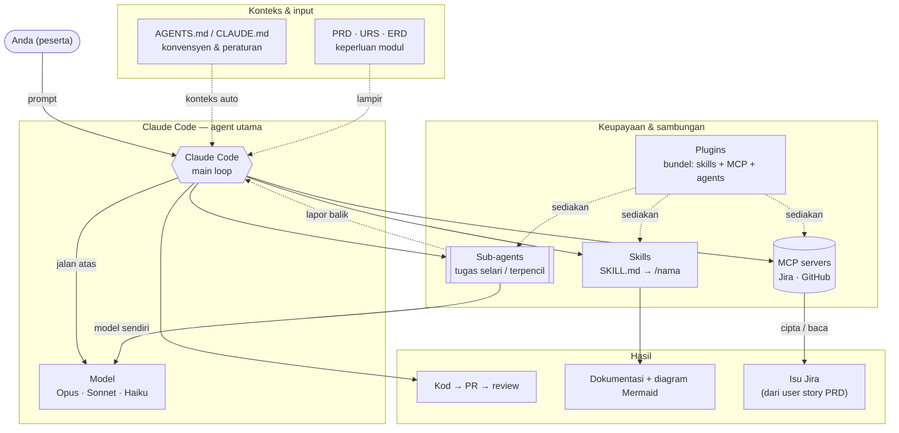

# Diagram — Bagaimana Claude Code berfungsi (ekosistem)

> **Bahan rujukan kursus (Hari 2 · Claude Code).** Diagram Mermaid ini menunjukkan bagaimana **Claude Code** mengikat model, sub-agent, MCP, skills, plugins, fail konteks, dan aliran **PRD**. Render dalam VS Code atau GitHub.



## Komponen

| Komponen | Peranan |
|----------|---------|
| **Claude Code** (main loop) | Agent utama di terminal — terima prompt, guna alat, hasilkan output. Ia membaca `AGENTS.md`/`CLAUDE.md` repo secara automatik. |
| **Model** (Opus · Sonnet · Haiku) | "Otak" yang menjalankan agent. **Opus** = seni bina / analisis dalam; **Sonnet** = kerja standard; **Haiku** = carian pantas / murah. |
| **Sub-agents** | Claude Code boleh **spawn** sub-agent untuk kerja **selari** atau **terpencil** (cth cari merentas banyak fail, semakan bebas). Setiap sub-agent ada model + konteks sendiri, dan **lapor balik** hasil sahaja. |
| **MCP** (Model Context Protocol) | Menyambung Claude Code ke **sistem luar** sebagai alat — cth **Jira** (cipta isu dari user story PRD), GitHub. Tambah dengan `claude mcp add …`; auth melalui `/mcp`. |
| **Skills** (`SKILL.md`) | Arahan / aliran kerja **boleh guna semula**, dipanggil `/nama` (atau auto). Cth skill `/dok-modul` menjana dokumentasi + diagram ikut konvensyen. |
| **Plugins** | **Bundel** yang menyediakan beberapa skills + slash commands + pelayan MCP + agents sekali gus. |
| **AGENTS.md / CLAUDE.md** | Fail **konteks projek** — konvensyen, nama entiti, peraturan — dimuat automatik supaya setiap sesi konsisten. |
| **PRD · URS · ERD** | **Input keperluan** yang memandu prompt. PRD boleh-bina → prompt → kod/docs/isu. |
| **Hasil** | **Kod → PR → review**, **dokumentasi + diagram Mermaid**, dan **isu Jira** (dari user story PRD). |

## Aliran dalam kursus

```text
URS  →  PRD  →  prompt (rujuk AGENTS.md)  →  Claude Code (model)
        │                                       │
        │                          ┌────────────┼─────────────┐
        │                       skills          MCP        sub-agents
        │                          │             │             │
        └──────────────►   docs + diagram   isu Jira     kerja selari
                                    │             │             │
                                    └──────►  PR + review  ◄─────┘
                                        (acceptance criteria = Definition of Done)
```

- **Konteks dahulu:** setiap sesi bermula dengan `AGENTS.md`; lampirkan PRD untuk kerja satu ciri.
- **Pilih model ikut tugas:** Opus untuk keputusan seni bina; Sonnet/Haiku untuk kerja rutin.
- **MCP** memautkan kod ↔ Jira (kunci projek per sistem: `LD`, `PKS`, `CM`, `PPK`/`PK`/`PASP`, `ID`, `FS`).
- **Skills/plugins** menstandardkan tugas berulang (dokumentasi, diagram) supaya keenam-enam sistem konsisten.
- **Manusia sahkan:** tiada commit tanpa faham — AC/DoD ialah pintu akhir, bukan "kod ditulis".
