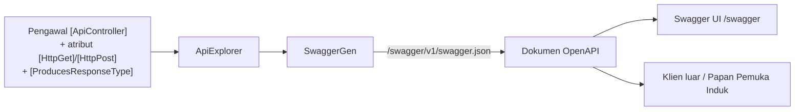

# Lab — Bina Web API dengan Swagger (OpenAPI)

> 🔧 **Kenapa modul MVC perlu API?** Papan Pemuka Induk Hari 15 menyatukan 6 sistem **melalui Profile DB / API**, dan beberapa aliran sebenar memerlukan titik masuk mesin-ke-mesin (cth *"sediakan API untuk trigger permohonan akaun AD & e-mel"*). Dalam lab ini setiap modul **mendedahkan** sebahagian datanya sebagai **Web API** berdokumen **Swagger** — sama seperti API Profile yang anda **guna** dalam [`lab-sso-profile.md`](./lab-sso-profile.md), kini anda pula yang **menyediakan** satu.

> ⚠️ **BACA DULU — perubahan .NET 10.** `dotnet new webapi` **tidak lagi** menyertakan Swagger UI. Sejak .NET 9, Swashbuckle dibuang daripada templat. Anda kini dapat **penjanaan dokumen OpenAPI terbina** sahaja:
> ```csharp
> builder.Services.AddOpenApi();   // pakej Microsoft.AspNetCore.OpenApi
> app.MapOpenApi();                // sajikan /openapi/v1.json — TIADA halaman UI
> ```
> Jadi `/swagger` **404** secara lalai dan ramai sangka projek rosak. Untuk **UI interaktif** (Try it out), tambah pakej sendiri. Lab ini guna **Swashbuckle** (rupa `api-docs` yang biasa) + pengawal `[ApiController]`.

## Tiga bahagian setup

| Bahagian | Pakej / API | Peranan |
|----------|-------------|---------|
| **Dokumen OpenAPI** | `Swashbuckle.AspNetCore` → `AddSwaggerGen()` | jana spec JSON dari pengawal + anotasi |
| **UI Swagger** | `UseSwagger()` + `UseSwaggerUI()` | halaman `/swagger` interaktif (Try it out) |
| **API anda** | pengawal `[ApiController]` + DTO | titik akhir sebenar (baca/cipta `Submission`) |

## Rajah — dari mana Swagger dapat dokumen (Mermaid)



---

## Persediaan

- Projek modul sedia ada (ASP.NET Core MVC, .NET 10). Kita **tambah** lapisan API padanya — bukan projek baharu.
- Tambah pakej UI Swagger:
  ```bash
  dotnet add package Swashbuckle.AspNetCore
  ```
- Guna entiti aliran kerja **sedia ada** dalam repo anda (`Submission`, `SubmissionStatus`) — **jangan** cipta enum/entiti baharu. `SubmissionStatus` ialah enum **kongsi** (lihat `SPEC-KURSUS.md`): `Draft, Submitted, SupervisorApproved, AdminApproved, Rejected, Completed, Cancelled`.
- Data **sintetik** sahaja. API baca boleh terbuka untuk lab; API yang **menukar** data mesti dilindungi (lihat Latihan 3).

---

## Latihan 1 — Hidupkan Swagger UI

**Objektif:** Halaman `/swagger` interaktif berjalan di atas projek MVC anda.

### Langkah

1. Dalam `Program.cs`, daftar perkhidmatan (letak sebelum `builder.Build()`):
   ```csharp
   builder.Services.AddControllers();          // pengawal API (di sisi MVC anda)
   builder.Services.AddEndpointsApiExplorer(); // dedah metadata titik akhir
   builder.Services.AddSwaggerGen(c =>
   {
       c.SwaggerDoc("v1", new() { Title = "NRES Onboarding API", Version = "v1" });
   });
   ```
2. Selepas `var app = builder.Build();`, dedahkan dokumen + UI **dalam Development sahaja**:
   ```csharp
   if (app.Environment.IsDevelopment())
   {
       app.UseSwagger();      // /swagger/v1/swagger.json
       app.UseSwaggerUI();    // /swagger
   }
   ```
3. Pastikan pemetaan pengawal wujud (jangan buang laluan MVC sedia ada):
   ```csharp
   app.MapControllers();   // API attribute-routed
   app.MapDefaultControllerRoute();   // laluan MVC {controller=Home}/{action=Index}
   ```

### ✅ Semakan

- [ ] `dotnet run` → layari `/swagger` — halaman UI muncul (bukan 404)
- [ ] `/swagger/v1/swagger.json` memulangkan dokumen OpenAPI
- [ ] Laman MVC sedia ada masih berfungsi (API tidak menggantikan MVC)

---

## Latihan 2 — Pengawal API sebenar (`Submission`)

**Objektif:** Dedahkan **baca status** dan **cipta permohonan** melalui API, guna DTO (bukan entiti EF mentah).

### Langkah

1. Cipta **DTO** (jangan dedah entiti EF terus — elak lebih-dedah medan & gelung rujukan):
   ```csharp
   namespace Nres.Onboarding.Api.Dtos;

   public record SubmissionDto(
       int Id,
       string ReferenceNo,
       SubmissionStatus Status,
       string ApplicantNric,
       DateTime CreatedAt);

   public record CreateSubmissionRequest
   {
       [Required, StringLength(200)]
       public string Title { get; init; } = string.Empty;

       [Required, RegularExpression(@"^\d{12}$", ErrorMessage = "NRIC mesti 12 digit.")]
       public string ApplicantNric { get; init; } = string.Empty;
   }
   ```
2. Cipta pengawal `[ApiController]` (routing atribut; `[ApiController]` beri **400 automatik** bila `ModelState` tidak sah):
   ```csharp
   namespace Nres.Onboarding.Api.Controllers;

   [ApiController]
   [Route("api/submissions")]
   [Produces("application/json")]
   [Tags("Submissions")]
   public sealed class SubmissionsApiController(AppDbContext db, IReferenceNumberService refNo) : ControllerBase
   {
       /// <summary>Senarai permohonan (boleh tapis ikut status).</summary>
       [HttpGet]
       [ProducesResponseType(typeof(IEnumerable<SubmissionDto>), StatusCodes.Status200OK)]
       public async Task<IActionResult> List([FromQuery] SubmissionStatus? status)
       {
           var q = db.Submissions.AsNoTracking();
           if (status is not null) q = q.Where(s => s.Status == status);
           var items = await q.Select(s => new SubmissionDto(
               s.Id, s.ReferenceNo, s.Status, s.ApplicantNric, s.CreatedAt)).ToListAsync();
           return Ok(items);
       }

       /// <summary>Baca satu permohonan mengikut nombor rujukan.</summary>
       [HttpGet("{referenceNo}")]
       [ProducesResponseType(typeof(SubmissionDto), StatusCodes.Status200OK)]
       [ProducesResponseType(StatusCodes.Status404NotFound)]
       public async Task<IActionResult> Get(string referenceNo)
       {
           var s = await db.Submissions.AsNoTracking()
               .FirstOrDefaultAsync(x => x.ReferenceNo == referenceNo);
           return s is null ? NotFound()
               : Ok(new SubmissionDto(s.Id, s.ReferenceNo, s.Status, s.ApplicantNric, s.CreatedAt));
       }

       /// <summary>Cipta permohonan baharu (status awal = Draft).</summary>
       [HttpPost]
       [ProducesResponseType(typeof(SubmissionDto), StatusCodes.Status201Created)]
       [ProducesResponseType(StatusCodes.Status400BadRequest)]
       public async Task<IActionResult> Create(CreateSubmissionRequest req)
       {
           var s = new Submission
           {
               ReferenceNo = await refNo.NextAsync(),   // cth PKS-2026-000123 (prefix ikut modul)
               Status = SubmissionStatus.Draft,
               ApplicantNric = req.ApplicantNric,
               Title = req.Title,
               CreatedAt = DateTime.UtcNow
           };
           db.Submissions.Add(s);
           await db.SaveChangesAsync();
           var dto = new SubmissionDto(s.Id, s.ReferenceNo, s.Status, s.ApplicantNric, s.CreatedAt);
           return CreatedAtAction(nameof(Get), new { referenceNo = s.ReferenceNo }, dto);
       }
   }
   ```

### ✅ Semakan

- [ ] `GET /api/submissions` pulangkan senarai; `?status=Submitted` menapis
- [ ] `POST /api/submissions` dengan NRIC bukan 12-digit → **400** + mesej (tanpa kod tambahan — kesan `[ApiController]`)
- [ ] `POST` sah → **201 Created** + header `Location` ke `GET {referenceNo}`
- [ ] Status awal = `Draft`; nombor rujukan guna prefix modul anda (SPEC-KURSUS.md)

---

## Latihan 3 — Perkaya dokumen + amankan

**Objektif:** Swagger jelas & lengkap; titik akhir yang menukar data dilindungi.

### Langkah

1. **Komen XML** jadi keterangan Swagger. Dalam `.csproj`:
   ```xml
   <PropertyGroup>
     <GenerateDocumentationFile>true</GenerateDocumentationFile>
     <NoWarn>$(NoWarn);1591</NoWarn>
   </PropertyGroup>
   ```
   Dan dalam `AddSwaggerGen`:
   ```csharp
   var xml = Path.Combine(AppContext.BaseDirectory,
       $"{Assembly.GetExecutingAssembly().GetName().Name}.xml");
   c.IncludeXmlComments(xml);
   ```
   Kini `<summary>` pada setiap action muncul dalam UI.
2. **Kebenaran** — API baca boleh terbuka untuk lab, tetapi **cipta/luluskan mesti dilindungi**. Tandakan action yang menukar data:
   ```csharp
   [Authorize(Roles = "Applicant")]   // guna peranan SPEC; penyemak guna peranan modul (cth IctSecurityOfficer)
   [HttpPost]
   public async Task<IActionResult> Create(CreateSubmissionRequest req) { /* ... */ }
   ```
   > **Kontras dengan API Profile:** API baca Profile **tanpa auth** (rangkaian dipercayai). API anda yang **menulis** state tidak boleh menganggap begitu — lindungi dengan peranan (atau kunci API / JWT untuk mesin-ke-mesin). Jangan salin corak "tanpa auth" ke titik akhir yang menukar data.
3. **Kumpulkan** titik akhir dengan `[Tags("Submissions")]` dan namakan action supaya UI kemas.

### ✅ Semakan

- [ ] Setiap action ada keterangan (dari `<summary>`) dalam Swagger UI
- [ ] `POST`/kelulusan memerlukan log masuk + peranan; anonymous → **401/403**
- [ ] Skema DTO (bukan entiti EF) muncul di bahagian **Schemas** UI
- [ ] Baca sahaja terbuka; tulis dilindungi — sengaja & didokumen

---

## Benang kolaborasi

- API anda hidup **dalam repo modul sendiri** — ia adalah pandangan baca/tulis atas `Submission` **anda**, bukan atas Profile DB. **Jangan** dedahkan atau ubah kontrak Profile DB melalui API modul (itu milik repo [`profile`](https://github.com/nres-bpm/profile)).
- Kekalkan bentuk DTO **stabil** — Papan Pemuka Induk Hari 15 mungkin membacanya. Perubahan yang memecah (buang/namakan medan) mesti dimaklum.
- **Definition of Done:** `/swagger` berjalan; setiap action ada `[ProducesResponseType]` + keterangan; tulis dilindungi peranan; DTO (bukan entiti) didedahkan; ujian pengesahan lulus.

## Rujukan

- OpenAPI terbina .NET 10: `Microsoft.AspNetCore.OpenApi` (`AddOpenApi`/`MapOpenApi`) · UI: `Swashbuckle.AspNetCore` (SwaggerUI) atau `Scalar.AspNetCore`.
- Contoh API sebenar yang anda **guna**: Swagger Profile [`devprofile.nres.gov.my/SSO/api-docs.html`](https://devprofile.nres.gov.my/SSO/api-docs.html) — lihat [`lab-sso-profile.md`](./lab-sso-profile.md).
- Enum & entiti tepat: [`SPEC-KURSUS.md`](../SPEC-KURSUS.md) (§ Enum status, § Entiti setiap repo).
