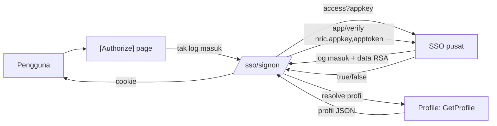
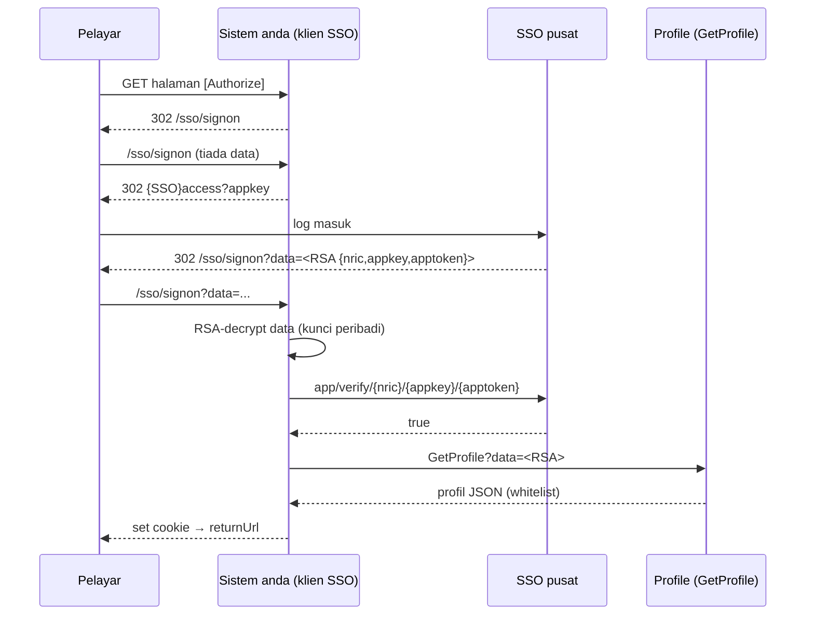

# Lab — Integrasi SSO & Baca Profil (Profile DB)

> 🔧 **Seni bina sebenar.** Sistem dalaman NRES **tidak** sambung terus ke Profile SQL DB. Ia (1) **log masuk melalui SSO** dan (2) **baca profil melalui API** (`GetProfile`) — semua muatan **RSA-encrypted**. App token disahkan **di pelayan SSO** (`app/verify`), bukan dikira secara tempatan.

## Tiga pihak

| Pihak | Alamat | Peranan |
|-------|--------|---------|
| **SSO pusat** | `devsso` / `sso.nres.gov.my` | `access`, `app/verify`, `logout`; simpan **Kunci App** + **Rahsia App**; keluarkan app token |
| **Profile** | `profile.nrecc.gov.my` | miliki **Profile DB** + API `GetProfile`; **Lapor Diri cipta** profil, lain **baca** |
| **Sistem anda** | subdomain sendiri | guna klien `Nres.Bpm.Sso.Client` — sign-on, resolve pengguna, baca profil |

## Rajah — aliran (Mermaid)

> Guna DIA-01/DIA-02/DIA-07 dalam [`pustaka-prompt.md`](./pustaka-prompt.md) untuk jana/ubah rajah ini; render dalam FigJam melalui MCP Figma ([`lab-mcp-jira-figjam.md`](./lab-mcp-jira-figjam.md)).

---

## Persediaan

- Pakej **`Nres.Bpm.Sso.Client`** (GitHub Packages) atau ProjectReference — lihat repo `nres-sso` README.
- App **didaftar pada SSO pusat** (URL Hantar Data → `/sso/signon`, URL Pengesahan → `/sso/validate?nric=`, Kaedah Hantar → HTTP Redirect (Encrypted)); anda dapat **AppKey**.
- **Keypair RSA**: `App.key` (peribadi, dalam app) + `App.pub.pem` (dimuat naik ke SSO). Jana dengan `openssl` (lihat README `nres-sso`).
- Data **sintetik** sahaja; rahsia (AppKey, kunci) via **user-secrets**, jangan commit.

---

## Latihan 1 — Sambung SSO

**Objektif:** App log masuk melalui SSO pusat.

### Langkah

1. Rujuk repo `nres-sso` README (prompt tampal-terus) — tambah pakej, konfigur `Nres:Sso` (dev `ServerUrl=https://devsso.nres.gov.my/`, `AppKey`, `PrivateKeyPath`), wire `Program.cs` (`AddNresSso` + `MapNresSso`).
2. Tambah pautan **Sign in** (`/sso/signon`) & **Sign out** (`/sso/signout`); lindungi halaman `[Authorize]`.

### ✅ Semakan

- [ ] `/sso/signon` bawa ke SSO pusat, balik dengan cookie (halaman `[Authorize]` boleh diakses)
- [ ] App token disahkan **remote** (`app/verify`) — tiada rahsia token dalam app

---

## Latihan 2 — Resolve pengguna (profil)

**Objektif:** Petakan NRIC (dari SSO) kepada pengguna dalam sistem anda.

### Langkah

1. Laksana `ISsoUserResolver`:
   - **Local dev:** senarai **sintetik in-memory** — NRIC **mesti padan** akaun ujian SSO pusat.
   - **Persekitaran sebenar:** panggil **GetProfile API** Profile (`GET /SSO/GetProfile.aspx?data=<RSA>`) → petakan medan whitelist (`FullName`, `UserEmail`, `Designation`, `OrganizationName`, `DepartmentName`, `UserType`…) ke `SsoUser`.
2. Pulangkan `null` untuk tolak sign-on (pengguna tidak dibenarkan).

### ✅ Semakan

- [ ] Sign-on berjaya untuk NRIC ujian; ditolak untuk NRIC tak dikenali
- [ ] Profil dibaca melalui **GetProfile** (bukan sambungan SQL terus)

---

## Latihan 3 — RBAC berdasarkan profil

**Objektif:** Kebenaran modul ditentukan **sistem anda**, bukan Profile DB.

### Langkah

1. Berdasarkan profil (cth `UserType`, `Group`/`Grade`, atau petaan tempatan), tetapkan peranan → `[Authorize(Roles = "…")]`.
2. Uji: pengguna tanpa peranan ditolak; dengan peranan dibenarkan.

### ✅ Semakan

- [ ] Profile DB beri **identiti**; peranan/akses ditentukan sistem anda (RBAC)
- [ ] `[Authorize(Roles=…)]` betul pada setiap action yang perlu

---

## Rujukan

- Klien & setup: repo **`nres-sso`** README (Quick start · registration · paste-in prompt).
- API baca profil: `Profile/docs/GetProfile-API.md` · spec: `Profile/…/SSO/openapi.json`.
- MCP Jira + FigJam: [`lab-mcp-jira-figjam.md`](./lab-mcp-jira-figjam.md) · prompt rajah: [`pustaka-prompt.md`](./pustaka-prompt.md).
