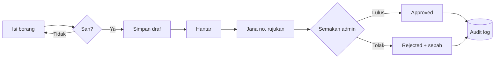
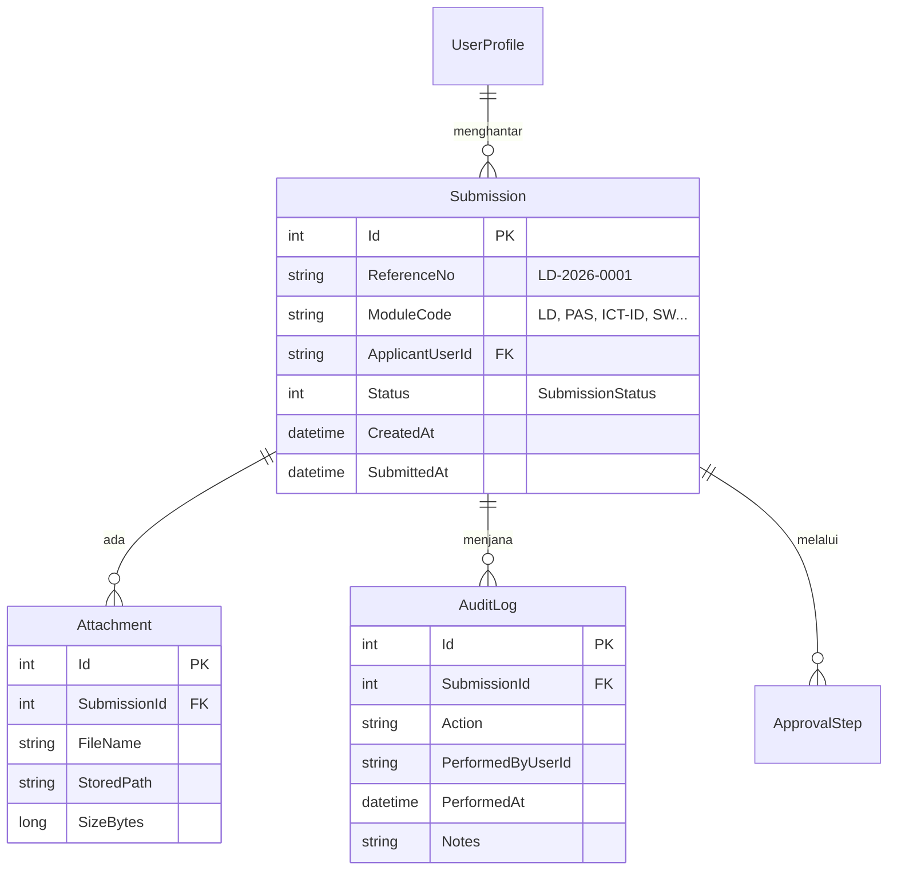
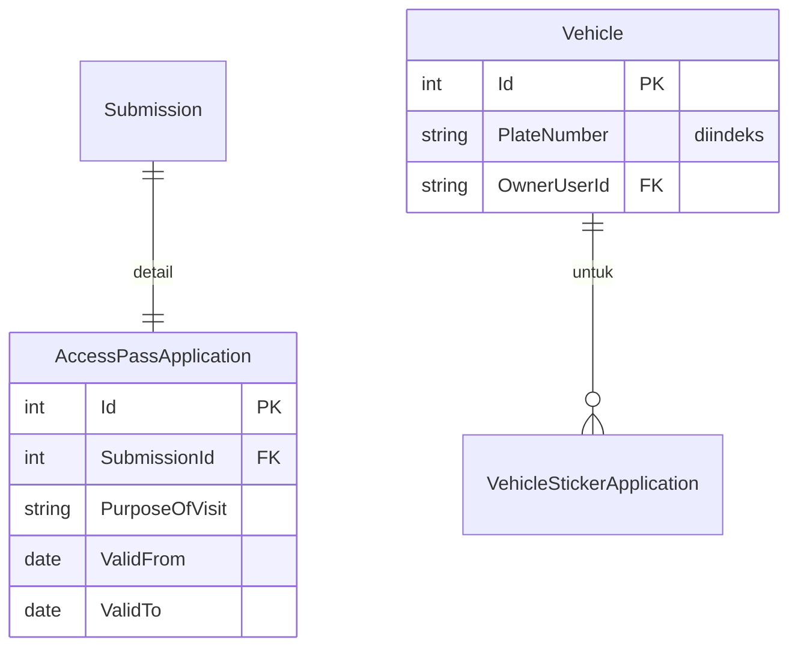

# Hari 1 — Perancangan Projek, Dokumentasi, URS & ERD

Nota ini mengikut **aturcara rasmi HARI 1** dalam [`../JADUAL.md`](../JADUAL.md) — SESI 1 hingga SESI 4. Bahagian ini menerangkan **konsep** (kenapa sesuatu wujud); langkah hands-on penuh ada di [`snippets/lab.md`](./snippets/lab.md).

Kursus: **DOTNET-NRES-15** — *Latihan Secara Coaching Pembangunan Sistem Onboarding & Khidmat Dalaman NRES Menggunakan ASP.NET Core*.

> **Konvensyen bahasa:** Nota & penerangan dalam **Bahasa Melayu**; kod, nama kelas, dan istilah teknikal (`entity`, `use case`, `foreign key`) dikekalkan dalam **Bahasa Inggeris**.

> **Hari ini tiada C#.** Ini disengajakan. Kita tulis **dokumen**, bukan kod — kerana keputusan yang dibuat hari ini menentukan sama ada empat kumpulan boleh bekerja selari selama 11 hari tanpa berlanggar.

---

## Fokus Hari Ini

| Topik | Rujukan |
|-------|---------|
| Keperluan pengguna (URS) vs spesifikasi perisian (SRS) | [ISO/IEC/IEEE 29148 — ringkasan](https://en.wikipedia.org/wiki/ISO/IEC_IEEE_29148) |
| Use case & aktor | [UML Use Case — gambaran](https://en.wikipedia.org/wiki/Use_case_diagram) |
| Diagram sebagai kod | [Mermaid — dokumentasi rasmi](https://mermaid.js.org/intro/) |
| Mermaid flowchart | [mermaid.js.org/syntax/flowchart](https://mermaid.js.org/syntax/flowchart.html) |
| Mermaid ERD | [mermaid.js.org/syntax/entityRelationshipDiagram](https://mermaid.js.org/syntax/entityRelationshipDiagram.html) |
| Pemodelan data & hubungan | [learn.microsoft.com/ef/core/modeling/relationships](https://learn.microsoft.com/en-us/ef/core/modeling/relationships) |

---

## Jadual Hari Ini

| Masa | Agenda |
|------|--------|
| 8.30 – 9.00 pagi | Pendaftaran Peserta & Minum Pagi |
| **9.00 – 10.30 pagi** | **SESI 1: Perancangan Projek & Skop** — sistem NRES sebagai *request workflow system*; 4 modul & kumpulan; peranan; risiko; definisi "siap". 🧠 Bengkel: peta medan sama merentas 4 modul |
| **10.30 – 1.00 tgh** | **SESI 2: URS & SRS** — beza URS vs SRS; keperluan yang boleh diuji; kriteria penerimaan. 💻 Lab: URS modul sendiri (draf AI → semakan manusia) |
| 1.00 – 2.30 petang | Rehat dan Makan Tengah Hari |
| **2.30 – 3.45 petang** | **SESI 3: Process Flow & Use Case** — aktor, use case, aliran utama vs alternatif; diagram sebagai kod (Mermaid). 💻 Lab: process flow + use case diagram |
| **3.45 – 5.00 petang** | **SESI 4: ERD & Reka Bentuk Data** — entiti, hubungan, kardinaliti, kunci asing; kenapa satu `Submission` induk dikongsi. 💻 Lab: ERD modul + sahkan terhadap SPEC |
| 5.00 petang | Bersurai |

**Hasil Hari 1:** `docs/URS-modul-N.md`, `docs/use-case-modul-N.md`, `docs/erd-modul-N.md` bagi setiap kumpulan; peserta boleh terangkan keempat-empat modul dan corak aliran kerja kongsi.

---

## SESI 1 — Perancangan Projek & Skop

### Kenapa mula dengan perancangan, bukan terus menaip kod?

Ramai peserta menganggap sistem ini "borang HTML yang simpan ke pangkalan data". Itu tidak salah, tetapi tidak cukup — dan salah faham ini menjadi mahal apabila **empat kumpulan** membina serentak.

Sistem NRES sebenarnya ialah **request workflow system**. Setiap permohonan — tidak kira jenisnya — melalui kitaran hayat yang sama:

```text
Form → Validation → Draft → Submit → Review → Approve/Reject → Audit → Report
```

Kalau kita nampak corak ini **hari ini**, kita boleh membina bahagian yang sama **sekali sahaja** (Hari 3) dan keempat-empat kumpulan menggunakannya. Kalau kita tidak nampak, setiap kumpulan akan membina versinya sendiri, dan Hari 15 akan mempunyai empat cara berlainan untuk meluluskan sesuatu.

**Perancangan hari ini secara langsung menjimatkan kerja pada Hari 15.** Itu argumennya — bukan "dokumentasi itu amalan baik".

### Empat modul, empat kumpulan

| Kumpulan | Modul | Admin | Prefix |
|----------|-------|-------|--------|
| 1 | **Lapor Diri** — permohonan lapor diri pekerja baharu | `HrAdmin` | `LD` |
| 2 | **Pas, Parkir & Pelekat** — akses kawasan & kenderaan | `SecurityAdmin` | `PAS` `PKR` `STK` |
| 3 | **ID, AD & Email** — akaun pengguna & akses sistem | `Supervisor` → `IctAdmin` | `ICT-ID` |
| 4 | **Perisian & Aset ICT** — lesen, pinjaman & pemulangan | `IctAdmin` | `SW` `AST-L` `AST-R` |

Setiap kumpulan memiliki modulnya **hujung ke hujung** — reka bentuk data, borang, aliran kelulusan, laporan, ujian. Kumpulan tidak menulis kod untuk modul kumpulan lain.

### Bengkel: peta medan sama merentas 4 modul

Sebelum menulis apa-apa, kenal pasti medan yang **berulang** dalam hampir semua borang NRES:

nama pemohon · nombor rujukan · jabatan · status · tarikh hantar · lampiran sokongan · catatan kelulusan/penolakan · siapa lulus/tolak dan bila

Medan-medan inilah yang akan menjadi `Submission` + `Attachment` + `AuditLog` — bukan kerana kebetulan, tetapi kerana ia **benar-benar sama** merentas Lapor Diri, Pas Keselamatan, Permohonan ID AD, dan Aset ICT.

**Kenapa satu `Submission` induk dikongsi?** Kalau setiap modul mereka status dan aliran kerjanya sendiri (`LaporDiriStatus`, `PasStatus`, `IctStatus`, …), maka setiap laporan pengurusan, setiap dashboard, dan setiap logik kelulusan perlu ditulis **empat kali**. Dengan satu jadual `Submissions` yang menyimpan `ReferenceNo`, `ModuleCode`, `Status`, `ApplicantUserId`, dan tarikh penting, setiap modul cuma menambah jadual **detail** sendiri yang berkongsi kunci asing `SubmissionId`. Dashboard induk, carian rujukan global, dan panel audit (Hari 15) ditulis **sekali** dan berfungsi untuk keempat-empat modul.

Corak ini dipanggil **kongsi induk, khusus detail** (*shared header, specific detail*) — sangat lazim dalam sistem permohonan kerajaan berbilang jenis borang.

### Risiko projek yang kita uruskan secara sedar

| Risiko | Kesan jika diabaikan | Cara kita tangani |
|--------|----------------------|-------------------|
| Empat kumpulan mengedit fail yang sama | Konflik gabungan Hari 15 | Seni bina modul mendaftar diri (Hari 3) + matriks pemilikan fail ([`KOLABORASI.md`](../KOLABORASI.md)) |
| Empat versi logik yang sama | Sistem tidak boleh diselenggara | Daftar komponen kongsi + code review |
| AI menjana semula kod sedia ada | Duplikasi senyap | `AGENTS.md` kongsi + peraturan *cari dahulu* |
| Keperluan tidak jelas | Bina benda yang salah dengan cekap | URS bertulis + kriteria penerimaan (hari ini) |
| Kerja disimpan sampai Hari 15 | Gabungan gagal | Gabungan latihan hujung setiap blok |

### Definisi "siap"

Satu ciri **bukan** siap apabila ia "berfungsi pada mesin saya". Definition of Done penuh ada dalam [`KOLABORASI.md`](../KOLABORASI.md) §9 — baca hari ini, guna selama 11 hari.

---

## SESI 2 — URS & SRS

### Beza URS dan SRS

| | **URS** (User Requirements Specification) | **SRS** (Software Requirements Specification) |
|---|---|---|
| Menjawab | **Apa** yang pengguna perlu buat | **Bagaimana** sistem menyediakannya |
| Bahasa | Bahasa pengguna | Bahasa teknikal |
| Ditulis oleh | Pengguna + penganalisis | Pasukan pembangunan |
| Contoh | "Pegawai HR mesti boleh menolak permohonan lapor diri dengan sebab" | "`POST /OfficerReporting/Reject` memerlukan `RejectionReason` tidak kosong (maks 500 aksara), menetapkan status kepada `Rejected`, menulis `AuditLog`, dan mencetuskan `INotificationService`" |

Kita menulis **kedua-duanya** hari ini: URS dahulu (apa yang NRES perlukan), kemudian menterjemahkannya menjadi keperluan sistem yang boleh diuji.

### Ciri keperluan yang baik

Keperluan yang baik adalah **boleh diuji**. Jika anda tidak boleh menulis ujian yang lulus atau gagal, ia bukan keperluan — ia harapan.

| ❌ Lemah | ✅ Baik |
|---------|--------|
| "Sistem mesti pantas" | "Senarai permohonan memuat dalam 2 saat untuk 1,000 rekod" |
| "Muat naik dokumen selamat" | "Hanya PDF/JPG/PNG, maksimum 5 MB, disimpan di luar `wwwroot`, hanya pemohon dan admin modul boleh memuat turun" |
| "Kelulusan mesti dijejak" | "Setiap perubahan status merekod pengguna, cap masa, status lama/baharu, dan catatan dalam `AuditLog`" |
| "Elakkan permohonan pendua" | "Sistem menolak permohonan pelekat baharu jika nombor plat sama sudah ada permohonan berstatus `Submitted`, `SupervisorApproved`, atau `AdminApproved`" |

**Format yang kita guna** (setiap keperluan mendapat ID supaya boleh dirujuk dalam isu, commit, dan ujian):

```markdown
### URS-LD-005 — Tolak permohonan dengan sebab

**Sebagai** Pegawai HR
**Saya mahu** menolak permohonan lapor diri dengan sebab bertulis
**Supaya** pemohon tahu apa yang perlu dibetulkan

**Kriteria penerimaan**
- [ ] Butang "Tolak" hanya kelihatan kepada peranan `HrAdmin`
- [ ] Sebab penolakan wajib diisi (1–500 aksara)
- [ ] Status bertukar `Submitted` → `Rejected`
- [ ] `AuditLog` merekod pengguna, masa, dan sebab
- [ ] Pemohon menerima notifikasi
- [ ] Permohonan yang ditolak tidak boleh ditolak semula

**Keutamaan:** Mesti ada
```

### Menggunakan AI untuk URS — cara berdisiplin

AI sangat pantas menghasilkan draf pertama URS, dan **sangat yakin ketika ia salah**. Peraturan kursus:

**AI menulis draf. Manusia memutuskan.**

Aliran kerja yang kita guna hari ini:

1. **Beri konteks, bukan soalan kosong.** Beri AI borang NRES sebenar dan `SPEC-KURSUS.md`, bukan "tulis URS untuk sistem lapor diri".
2. **Minta ia bertanya dahulu.** *"Sebelum menulis, senaraikan 10 soalan yang anda perlu tahu tentang proses ini."* Soalan-soalan itu selalunya lebih berharga daripada draf.
3. **Jana draf.**
4. **Semak baris demi baris.** Tandakan setiap keperluan: ✅ betul · ✏️ perlu betulkan · ❌ AI mereka-reka ini.
5. **Cabar ia.** *"Keperluan mana yang anda paling kurang yakin? Apa yang anda andaikan tentang NRES yang mungkin salah?"*
6. **Tanya apa yang tiada.** *"Kes tepi apa yang URS ini terlepas? Apa yang berlaku jika pemohon meletak jawatan sebelum kelulusan?"*

> **Langkah 4 tidak boleh dilangkau.** Peserta yang menyerahkan URS jana-AI tanpa semakan akan mendapati Hari 7 bahawa mereka membina peraturan perniagaan yang NRES tidak pernah minta. Ini berlaku setiap kali ia dibenarkan berlaku.

**Apa yang AI TIDAK boleh putuskan:** siapa meluluskan apa · berapa lama pas keselamatan sah · sama ada staf boleh mempunyai dua kenderaan · apa yang berlaku kepada aset yang hilang. Ini **keputusan dasar NRES**. Jika ia tiada dalam dokumen sumber, tandakan sebagai **soalan terbuka** — jangan biar AI mengisinya.

---

## SESI 3 — Process Flow & Use Case

### Aktor dan use case

**Aktor** ialah sesiapa (atau apa) yang berinteraksi dengan sistem. Dalam sistem NRES, aktor kita sepadan terus dengan peranan dalam [`SPEC-KURSUS.md`](../SPEC-KURSUS.md):

`Applicant` · `Supervisor` · `HrAdmin` · `SecurityAdmin` · `IctAdmin` · `SystemAdmin`

**Use case** ialah satu matlamat lengkap yang seorang aktor capai — "Hantar permohonan lapor diri", bukan "klik butang simpan". Ujian ringkas: jika aktor berhenti selepas melakukannya, adakah mereka mencapai sesuatu yang berguna?

Setiap use case ada **aliran utama** (semua berjalan lancar) dan **aliran alternatif** (perkara menjadi menarik):

```text
Use case: Hantar permohonan lapor diri
Aktor utama: Applicant

Aliran utama:
  1. Applicant membuka borang lapor diri
  2. Applicant mengisi maklumat peribadi
  3. Applicant memuat naik dokumen sokongan
  4. Applicant menghantar
  5. Sistem menjana nombor rujukan (LD-2026-####)
  6. Sistem menukar status kepada Submitted
  7. Sistem merekod audit dan memberitahu HR

Aliran alternatif:
  3a. Dokumen melebihi 5 MB → sistem menolak, kekalkan borang
  4a. Medan wajib kosong → papar ralat validation, jangan hantar
  4b. Applicant sudah ada permohonan aktif → sekat dengan mesej jelas
  7a. Notifikasi gagal → permohonan tetap dihantar, kegagalan dilog
```

**Aliran alternatif itulah tempat pepijat bersembunyi.** Peserta yang hanya memodelkan aliran utama akan menghabiskan Hari 7–9 menemuinya semula satu demi satu.

### Kenapa diagram sebagai kod (Mermaid)?

Kita menulis diagram dalam **Mermaid** — teks biasa yang dirender sebagai gambar rajah dalam GitHub, VS Code, dan Visual Studio.

| Alat lukisan (Visio, draw.io) | Mermaid |
|-------------------------------|---------|
| Fail binari | Teks biasa |
| Tidak boleh di-`diff` dalam Git | `git diff` menunjukkan apa yang berubah |
| Konflik gabungan tidak boleh diselesaikan | Konflik diselesaikan seperti kod |
| Hidup di luar repo, cepat lapuk | Hidup bersama kod, dikemas kini dalam PR yang sama |

Dalam projek 4 pasukan, ini penting: diagram anda ialah **dokumen hidup** yang disemak dalam PR, bukan gambar yang seseorang lukis pada Hari 1 dan tiada siapa lihat lagi.



> Rujukan rasmi: [mermaid.js.org/syntax/flowchart](https://mermaid.js.org/syntax/flowchart.html)

---

## SESI 4 — ERD & Reka Bentuk Data

### Apa yang ERD tunjukkan

**Entity Relationship Diagram** menunjukkan entiti (jadual), atributnya, dan cara ia berhubung. Tiga perkara yang perlu betul:

1. **Entiti** — kata nama dalam domain anda (`Submission`, `Vehicle`, `Asset`)
2. **Hubungan** — cara ia berpaut (`Submission` ada banyak `Attachment`)
3. **Kardinaliti** — berapa banyak pada setiap hujung (satu-ke-banyak, banyak-ke-banyak)

### Kardinaliti dalam sintaks Mermaid

| Sintaks | Maksud |
|---------|--------|
| `||--o{` | Satu ke sifar-atau-lebih |
| `||--|{` | Satu ke satu-atau-lebih |
| `||--||` | Satu ke tepat satu |
| `}o--o{` | Banyak ke banyak |

### Teras kongsi — sama untuk keempat-empat kumpulan



**Setiap kumpulan melanjutkan teras ini** dengan jadual detail modulnya sendiri, dipaut melalui `SubmissionId`. Contoh Kumpulan 2:



### Peraturan kritikal: jangan pendua medan induk

Jadual detail modul anda **tidak boleh** mengandungi `ReferenceNo`, `Status`, `ApplicantUserId`, atau tarikh hantar. Semua itu sudah ada dalam `Submission`.

**Kenapa ini penting:** dua salinan status bermakna dua sumber kebenaran. Satu hari nanti ia akan berbeza — status `Submission` menunjukkan `Approved`, jadual detail menunjukkan `Submitted` — dan tiada siapa tahu yang mana betul. Ini punca pepijat paling kerap dalam sistem permohonan sebenar.

Ini juga sebab **anti-redundan bermula di lapisan data**, bukan di lapisan kod.

### Menggunakan AI untuk ERD

AI berguna untuk: mencadangkan entiti yang terlepas · mengesan hubungan yang tiada · menamakan medan secara konsisten · menjana sintaks Mermaid dari perihalan bertulis.

AI **kerap tersilap** dengan: kardinaliti (ia meneka satu-ke-banyak sedangkan sepatutnya banyak-ke-banyak) · mereka medan yang NRES tidak perlukan · mengabaikan `Submission` induk dan mereka jadual bebas.

**Prompt semakan wajib** selepas menjana ERD:

> "Bandingkan ERD ini dengan `SPEC-KURSUS.md`. Adakah ia memperkenalkan mana-mana entiti atau medan yang tiada dalam spec? Adakah ia menduplikasi medan yang sudah ada dalam `Submission`? Senaraikan percanggahan — jangan tulis semula ERD."

Kemudian **peserta membetulkannya sendiri**. Membetulkan ERD dengan tangan ialah cara anda benar-benar mempelajari model data yang akan anda gunakan selama 11 hari.

---

## Sebelum Hari 2

Baca [`../KOLABORASI.md`](../KOLABORASI.md) sepenuhnya. Esok kita menandatangani kontraknya dan menyediakan cabang Git — akan lebih bermakna jika anda sudah nampak apa yang cuba dihalang.

---

## Seterusnya

Ikuti langkah demi langkah di [`snippets/lab.md`](./snippets/lab.md) — anda akan:

1. Peta medan sama merentas 4 modul (bengkel berkumpulan)
2. Tulis URS modul kumpulan anda — draf AI, kemudian semakan manusia baris demi baris
3. Lukis process flow dalam Mermaid
4. Tulis use case dengan aliran utama **dan** alternatif
5. Reka ERD modul anda melanjutkan teras kongsi
6. Sahkan silang keempat-empat artifak terhadap `SPEC-KURSUS.md`

Nota penceramah: [`nota-penceramah.md`](./nota-penceramah.md).
