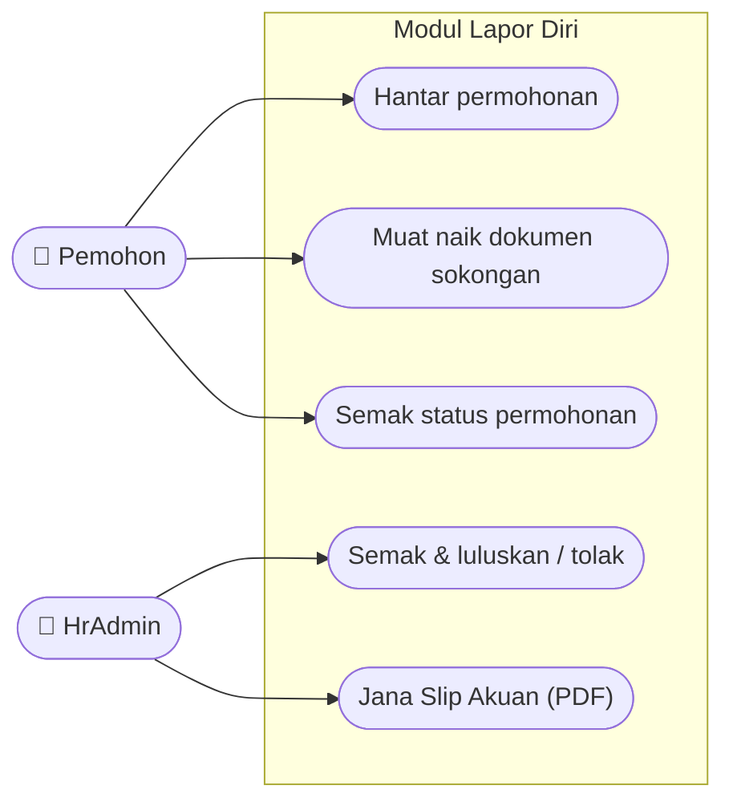
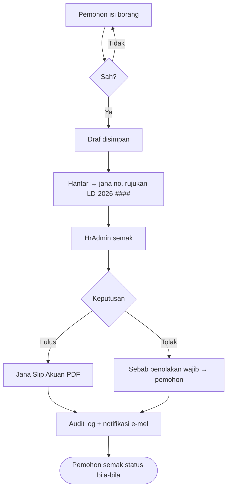
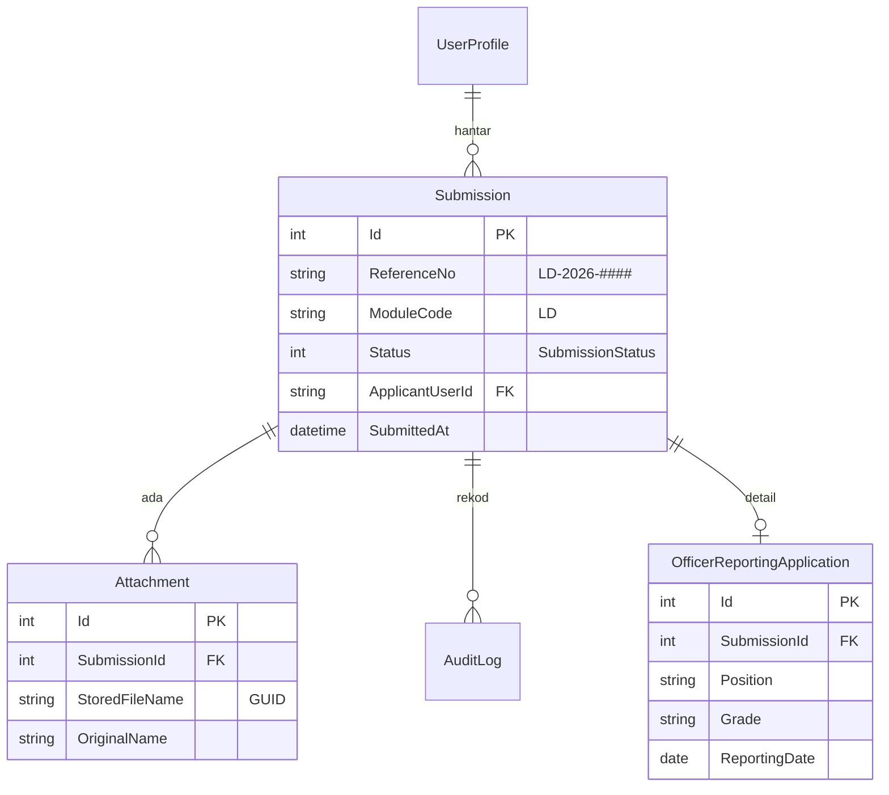
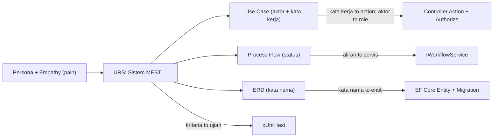

# Contoh Diagram — dari URS ke Use Case, Process Flow & ERD

> Rujukan untuk **SESI 3–4** (dan slaid *"Jambatan: dari URS ke diagram"*). Contoh penuh menggunakan modul **Lapor Diri**. Kanun: [`../../SPEC-KURSUS.md`](../../SPEC-KURSUS.md) · Konsep: [`../README.md`](../README.md).
>
> **Peraturan emas berterusan:** setiap diagram di bawah berpunca daripada artifak Design Thinking / URS yang sama — bukan direka baharu.
>
> Fail ini guna **Mermaid** (diagram sebagai kod). Ia dirender terus dalam GitHub & VS Code (pratonton). Tiada imej perlu disimpan.

---

## 0. Dari mana diagram datang (jambatan)

| Artifak DT / URS | Menjadi | Diagram |
|------------------|---------|---------|
| Persona + peranan (Pemohon, `HrAdmin`) | **Aktor** | Use Case |
| URS *kata kerja* — "Sistem **mesti paparkan status**" | **Use case** | Use Case |
| Empathy **DOES** (isi → hantar → telefon tanya) | **as-is → to-be** | Process Flow |
| URS *kata nama* — permohonan, status, lampiran, pengguna | **Entiti + hubungan** | ERD |

**Use Case = siapa buat apa** (kata kerja) · **ERD = data apa wujud** (kata nama) · entiti ERD → **kelas EF Core** di kod.

---

## 1. Use Case Diagram

*Aktor daripada persona/peranan; setiap bulatan ialah satu URS (kata kerja).*

> Setiap use case di atas boleh dijejak ke satu baris URS. Contoh: *"Semak status permohonan"* ← `URS-LD-03` ("Sistem mesti paparkan status semasa & sejarah setiap permohonan kepada pemohon").

---

## 2. Process Flow (aliran kerja)

*Perjalanan yang direka semula (to-be) — punca: Empathy **DOES** yang menyakitkan (isi kertas → hantar → telefon berkali-kali).*

> Bandingkan dengan aliran **sekarang** (as-is): pemohon *"telefon berkali-kali untuk tanya status"*. Nod **J** ialah penyelesaian kepada pain itu.

---

## 3. ERD (Entity-Relationship Diagram)

*Entiti = kata nama dalam URS. `Submission` induk **dikongsi** semua modul; Lapor Diri hanya menambah jadual detailnya.*

> **Jangan pendua medan induk.** `ReferenceNo`, `Status`, `ApplicantUserId` hidup **sekali** dalam `Submission` — bukan disalin ke `OfficerReportingApplication`. Ini keputusan reka bentuk paling penting Hari 1 (lihat SESI 4).
>
> **Ke kod:** setiap entiti ERD → satu kelas C# + `IEntityTypeConfiguration<T>` pada Hari 4. Benang tak putus: **empati → URS → diagram → kelas EF Core**.

---

## 4. Benang emas — dari Design Thinking ke Kod

*Ini yang selalu terlepas: **setiap artifak Hari 1 menjadi sekeping kod tertentu**. Itu sebabnya kita buat DT dahulu — bukan kerana "dokumentasi itu baik", tetapi kerana ia menentukan kod anda.*

### Peta: artifak → fungsi → kod

| Artifak (Hari 1) | Fungsi | Jadi apa dalam KOD (Hari 3–14) |
|------------------|--------|--------------------------------|
| Persona + Empathy (*pain*) | Faham pengguna | Punca segala keperluan |
| URS *kata kerja* — "paparkan status" | Tindakan | `Controller Action` + `[Authorize]` |
| URS *kata nama* — "permohonan, status" | Data | `EF Core Entity` + Migration |
| Use Case (aktor) | Peranan | `Role` · `[Authorize(Roles=…)]` |
| Process Flow (status) | Logik aliran | `IWorkflowService` |
| ERD (hubungan) | Struktur data | `DbContext` + `IEntityTypeConfiguration<T>` |
| Kriteria penerimaan | Bukti siap | `xUnit test` |

**Contoh benang penuh (Lapor Diri):**
> pain *"Saya tak tahu status permohonan saya"* → `URS-LD-03` *("Sistem mesti paparkan status…")* → **use case** "Semak status" → **kod**: `StatusController.Index()` yang membaca `Submission.Status`, dilindungi `[Authorize]`, disahkan oleh satu `xUnit test`.

Empati → URS → diagram → **kod**. Benang tak putus.

---

## Cuba sendiri

1. Salin mana-mana blok `mermaid` ke fail `.md` modul anda dan render dalam VS Code (pratonton) atau GitHub.
2. Ganti kandungan Lapor Diri dengan **modul kumpulan anda** — tetapi kekalkan `Submission` induk & corak yang sama.
3. Sahkan ERD anda terhadap [`../../SPEC-KURSUS.md`](../../SPEC-KURSUS.md) (nama entiti mesti tepat).
