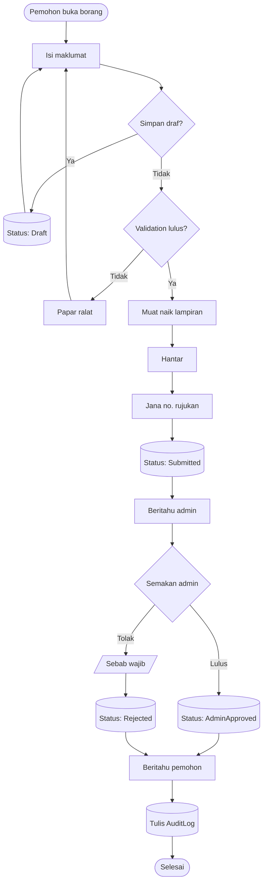
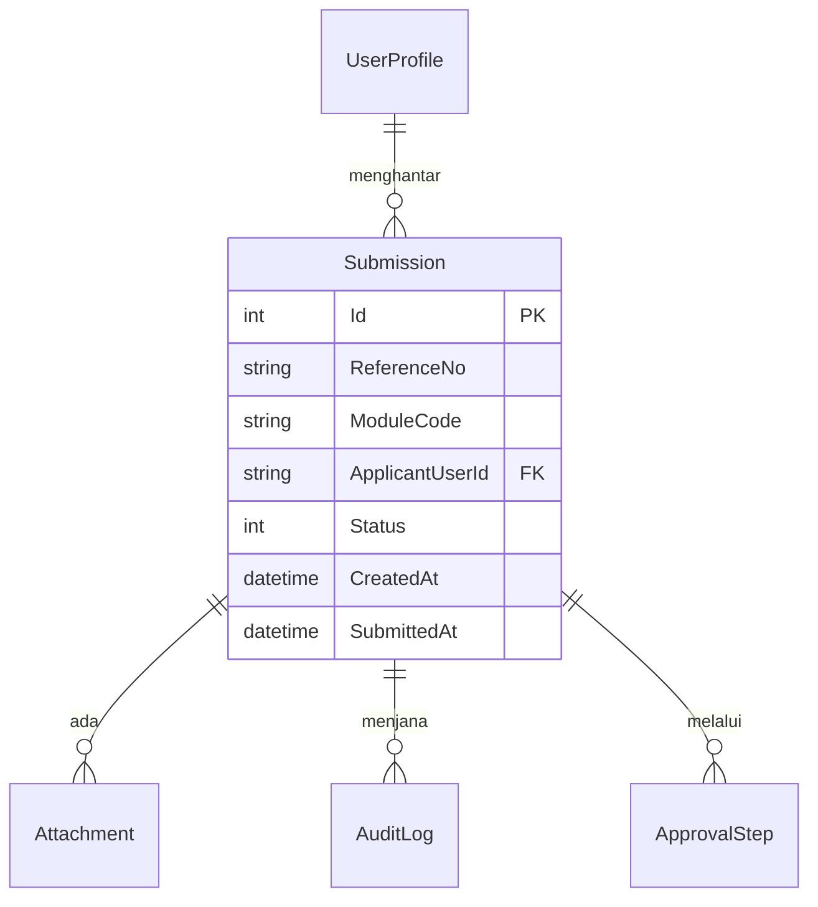

# Lab Hari 1 — Perancangan, URS, Use Case & ERD

> Konsep di [`../README.md`](../README.md). Kanun: [`../../SPEC-KURSUS.md`](../../SPEC-KURSUS.md). Kontrak pasukan: [`../../KOLABORASI.md`](../../KOLABORASI.md).
>
> **Hari ini kita menulis dokumen, bukan kod.** Setiap artifak yang anda hasilkan hari ini akan dirujuk sepanjang 11 hari pembangunan.

## Persediaan

- Editor teks (VS Code disyorkan — ia merender Mermaid secara terbina)
- Akses kepada borang NRES sebenar bagi modul kumpulan anda (diberi jurulatih)
- Pembantu AI (Claude, Copilot, dll.)
- Kertas/papan putih untuk bengkel

Cipta folder kerja kumpulan anda:

```bash
mkdir -p docs
```

Fail yang anda hasilkan hari ini (ganti `N` dengan nombor kumpulan anda):

```text
docs/
  URS-modul-N.md
  use-case-modul-N.md
  erd-modul-N.md
  soalan-terbuka-modul-N.md
```

---

## Latihan 0 — Kenal modul anda

**Objektif:** Setiap ahli kumpulan boleh menerangkan modul kumpulan dalam satu ayat, dan tahu peranan mana yang menyentuhnya.

### Langkah

1. Semak pengagihan kumpulan bersama jurulatih:

   | Kumpulan | Modul | Admin | Prefix |
   |----------|-------|-------|--------|
   | 1 | Lapor Diri | `HrAdmin` | `LD` |
   | 2 | Pas, Parkir & Pelekat | `SecurityAdmin` | `PAS` `PKR` `STK` |
   | 3 | ID, AD & Email | `Supervisor` → `IctAdmin` | `ICT-ID` |
   | 4 | Perisian & Aset ICT | `IctAdmin` | `SW` `AST-L` `AST-R` |

2. Baca borang NRES sebenar bagi modul anda. Senaraikan **setiap medan** yang anda nampak.

3. Tulis satu ayat yang menerangkan modul anda kepada seseorang yang tidak pernah melihatnya:

   > *"Modul Lapor Diri membolehkan pekerja baharu menghantar maklumat lapor diri dan dokumen sokongan mereka, dan membolehkan HR menyemak, meluluskan atau menolaknya, serta mengeluarkan slip akuan."*

4. Senaraikan peranan yang menyentuh modul anda dan apa yang setiap satu boleh buat.

### ✅ Semakan

- [ ] Setiap ahli kumpulan boleh menyebut ayat modul tanpa membaca
- [ ] Anda ada senarai medan borang sebenar
- [ ] Anda tahu peranan mana yang membuat apa dalam modul anda

---

## Latihan 1 — Bengkel: peta medan sama merentas 4 modul

**Objektif:** Temui sendiri **kenapa** satu `Submission` induk dikongsi — jangan diberitahu, temui.

### Langkah

1. **Berkumpulan (10 minit).** Pada kertas, senaraikan setiap medan dalam borang modul anda.

2. **Seluruh kelas (15 minit).** Setiap kumpulan membaca senarainya dengan kuat. Jurulatih menulis di papan putih dalam dua lajur:

   | Muncul dalam **semua** modul | Khusus **satu** modul |
   |------------------------------|------------------------|
   | Nama pemohon | Nombor plat kenderaan |
   | Jabatan | Tarikh mula bertugas |
   | Nombor rujukan | Nama perisian |
   | Status | Tempoh pinjaman |
   | Tarikh hantar | Jenis akaun AD |
   | Lampiran | … |
   | Sebab penolakan | |
   | Diluluskan oleh / bila | |

3. **Perbincangan (10 minit).** Jawab bersama:
   - Berapa medan berada dalam lajur kiri? *(Biasanya 8–12.)*
   - Jika setiap kumpulan membina jadualnya sendiri untuk medan ini, berapa kali kod yang sama ditulis?
   - Jika medan yang sama disimpan di empat tempat, apa yang berlaku apabila salah satu tidak segerak?

4. **Tulis kesimpulan** dalam `docs/soalan-terbuka-modul-N.md`:

```markdown
# Nota reka bentuk — Kumpulan N

## Kenapa Submission induk dikongsi
Medan berikut muncul dalam keempat-empat modul: <senarai>
Jika setiap modul menyimpannya sendiri, kami akan menulis logik yang sama 4 kali
dan berisiko data tidak segerak. Kami menyimpannya SEKALI dalam `Submission`,
dan modul kami hanya menyimpan medan khususnya.

## Medan khusus modul kami
<senarai>
```

### ✅ Semakan

- [ ] Papan putih menunjukkan lajur "kongsi" dengan sekurang-kurangnya 8 medan
- [ ] Kumpulan anda boleh menjelaskan kenapa duplikasi status berbahaya
- [ ] `docs/soalan-terbuka-modul-N.md` wujud dengan kesimpulan anda

---

## Latihan 2 — Tulis URS: draf AI

**Objektif:** Hasilkan draf pertama URS dengan AI — dengan konteks yang betul, bukan prompt kosong.

### Langkah

1. Kumpulkan konteks **sebelum** membuka AI:
   - Borang NRES sebenar modul anda (Latihan 0)
   - [`../../SPEC-KURSUS.md`](../../SPEC-KURSUS.md)
   - Senarai medan kongsi (Latihan 1)

2. **Minta soalan dahulu, bukan jawapan.** Prompt pertama anda:

```text
Saya sedang menulis URS (User Requirements Specification) untuk modul
"<nama modul anda>" dalam sistem dalaman NRES.

Konteks:
- Ini sistem aliran kerja permohonan. Setiap permohonan mengikut:
  Form → Validation → Draft → Submit → Review → Approve/Reject → Audit → Report
- Peranan: Applicant, Supervisor, HrAdmin, SecurityAdmin, IctAdmin, SystemAdmin
- Admin bagi modul saya: <peranan admin anda>
- Medan borang sebenar: <tampal senarai anda>

JANGAN tulis URS lagi. Sebaliknya, senaraikan 10 soalan yang anda perlu
jawapannya tentang proses NRES ini sebelum URS boleh ditulis dengan betul.
```

3. **Baca soalan-soalan itu dengan teliti.** Soalan yang anda **tidak boleh jawab** ialah jurang sebenar dalam kefahaman anda. Salin setiap satu ke `docs/soalan-terbuka-modul-N.md` di bawah tajuk:

```markdown
## Soalan terbuka untuk NRES
- [ ] <soalan yang kami tidak boleh jawab>
```

4. Jawab soalan yang **boleh** anda jawab daripada borang sebenar. Kemudian minta draf:

```text
Berikut jawapan kepada soalan anda: <jawapan anda>
Bagi soalan yang tidak dijawab, tandakan keperluan berkaitan sebagai
"ANDAIAN — perlu disahkan NRES" dan jangan reka jawapan.

Sekarang tulis URS dalam Bahasa Melayu menggunakan format ini bagi setiap keperluan:

### URS-<PREFIX>-<nnn> — <tajuk>
**Sebagai** <peranan>
**Saya mahu** <tindakan>
**Supaya** <faedah>

**Kriteria penerimaan**
- [ ] <boleh diuji, khusus>

**Keutamaan:** Mesti ada / Patut ada / Baik ada

Liputi: cipta draf, hantar, validation, muat naik lampiran, semakan admin,
lulus, tolak dengan sebab, penjejakan status, dan audit.
```

5. Simpan output sebagai `docs/URS-modul-N.md`.

### ✅ Semakan

- [ ] Anda meminta soalan **sebelum** meminta draf
- [ ] Soalan yang tidak terjawab direkod dalam `docs/soalan-terbuka-modul-N.md`
- [ ] `docs/URS-modul-N.md` wujud dengan keperluan ber-ID
- [ ] Keperluan berasaskan andaian ditanda **"ANDAIAN — perlu disahkan NRES"**

---

## Latihan 3 — Semak URS baris demi baris (langkah paling penting hari ini)

**Objektif:** Cari perkara yang AI silap. Ia sentiasa ada.

> **Jangan langkau latihan ini.** Peserta yang menerima URS jana-AI tanpa semakan akan mendapati pada Hari 7 bahawa mereka telah membina peraturan yang NRES tidak pernah minta.

### Langkah

1. **Bahagikan URS antara ahli kumpulan.** Setiap orang mengambil 3–5 keperluan.

2. **Tandakan setiap keperluan** dengan salah satu:

   | Tanda | Maksud | Tindakan |
   |-------|--------|----------|
   | ✅ | Betul seperti ditulis | Biarkan |
   | ✏️ | Hampir betul | Betulkan sekarang |
   | ❓ | Kami tidak tahu | Pindah ke soalan terbuka |
   | ❌ | AI mereka ini | Buang |

3. **Semak setiap kriteria penerimaan** terhadap ujian ini: *bolehkah saya menulis ujian yang lulus atau gagal untuk ini?* Jika tidak, tulis semula supaya boleh.

   ```markdown
   ❌ - [ ] Muat naik dokumen dikendalikan dengan selamat
   ✅ - [ ] Hanya PDF/JPG/PNG diterima; fail >5 MB ditolak dengan mesej ralat;
          fail disimpan di App_Data/uploads/{submissionId}/ bukan wwwroot
   ```

4. **Cabar AI mengenai kerjanya sendiri:**

```text
Semak URS yang anda baru tulis. Jawab dengan jujur:
1. Keperluan mana yang anda paling KURANG yakin?
2. Apa yang anda andaikan tentang proses NRES yang mungkin salah?
3. Kes tepi apa yang URS ini terlepas sepenuhnya?
4. Kriteria penerimaan mana yang tidak boleh diuji seperti ditulis?
Jangan tulis semula URS — cuma senaraikan masalah.
```

5. **Betulkan sendiri masalah yang dilaporkan.** Menaipnya dengan tangan ialah cara anda mempelajarinya.

6. **Tambah kes tepi yang biasa terlepas.** Semak modul anda terhadap senarai ini:
   - Apa berlaku jika pemohon meletak jawatan/berpindah sebelum kelulusan?
   - Bolehkah permohonan yang ditolak dihantar semula, atau adakah ia permohonan baharu?
   - Apa berlaku pada draf yang tidak disentuh selama 6 bulan?
   - Bolehkah pemohon membatalkan selepas menghantar tetapi sebelum semakan?
   - Siapa yang boleh melihat permohonan orang lain — dan kenapa?
   - Apa berlaku jika admin yang meluluskan juga pemohon?

### ✅ Semakan

- [ ] Setiap keperluan ditanda ✅ / ✏️ / ❓ / ❌
- [ ] Sekurang-kurangnya satu keperluan ✏️ atau ❌ ditemui *(jika tiada, anda tidak menyemak dengan cukup teliti)*
- [ ] Setiap kriteria penerimaan boleh diuji
- [ ] Sekurang-kurangnya 3 kes tepi ditambah
- [ ] Setiap ahli kumpulan boleh menerangkan setiap keperluan yang mereka semak

---

## Latihan 4 — Process flow dalam Mermaid

**Objektif:** Lukis aliran permohonan modul anda sebagai kod yang boleh diversi dalam Git.

### Langkah

1. Cipta `docs/use-case-modul-N.md` dan mula dengan process flow.

2. Tulis aliran modul anda. Mulakan dari templat ini dan **ubah suai kepada modul anda** — jangan salin bulat-bulat:

````markdown
# Use Case & Process Flow — Modul <nama> (Kumpulan N)

## Process flow — permohonan hujung ke hujung


````

3. **Kumpulan 3 sahaja:** aliran anda ada **dua** peringkat kelulusan. Ubah suai:

```text
Submitted → Semakan Penyelia → SupervisorApproved → Pemprosesan ICT → Completed
```

4. **Kumpulan 4 sahaja:** anda ada **dua** aliran berkaitan — pinjaman dan pemulangan. Lukis kedua-duanya, dan tunjukkan cara status aset berubah (`Available` → `OnLoan` → `Available`/`UnderMaintenance`).

5. Render diagram (VS Code: buka pratonton Markdown). Betulkan sebarang ralat sintaks.

### ✅ Semakan

- [ ] Diagram merender tanpa ralat
- [ ] Setiap status dalam diagram wujud dalam `SubmissionStatus` (`SPEC-KURSUS.md`)
- [ ] Laluan penolakan menunjukkan sebab wajib
- [ ] Penulisan audit kelihatan dalam aliran
- [ ] Diagram sepadan dengan modul **anda**, bukan templat

---

## Latihan 5 — Use case dengan aliran alternatif

**Objektif:** Modelkan apa yang berlaku apabila keadaan tidak sempurna — di situlah pepijat bersembunyi.

### Langkah

1. Kenal pasti **3–5 use case utama** modul anda. Ujian: adakah aktor mencapai sesuatu yang berguna?

   Contoh Kumpulan 2: *Mohon pas keselamatan* · *Mohon pelekat kenderaan* · *Semak permohonan pas* · *Sahkan pas semasa rondaan*

2. Bagi **setiap** use case, tulis dalam `docs/use-case-modul-N.md`:

```markdown
## UC-<PREFIX>-01 — <tajuk>

**Aktor utama:** <peranan>
**Prasyarat:** <apa mesti benar sebelum ini bermula>
**Jaminan kejayaan:** <apa yang benar selepas ia berjaya>

### Aliran utama
1. …
2. …

### Aliran alternatif
- **1a.** <keadaan> → <apa sistem buat>
- **3a.** <keadaan> → <apa sistem buat>

### Keperluan berkaitan
URS-<PREFIX>-001, URS-<PREFIX>-004
```

3. **Guna AI untuk mencari yang terlepas** — bukan untuk menulisnya:

```text
Berikut use case saya untuk modul <nama>: <tampal>

Senaraikan aliran alternatif yang saya terlepas. Bagi setiap satu, nyatakan
keadaan yang mencetuskannya dan apa yang sistem sepatutnya buat.
Fokus pada: kegagalan validation, konflik kebenaran, keadaan berlumba
(dua orang bertindak serentak), dan permohonan pendua.
Jangan tulis semula use case saya.
```

4. Tambah aliran alternatif yang munasabah. **Jangan tambah semua** — nilai setiap satu terhadap keperluan NRES sebenar dan tandakan yang meragukan dalam soalan terbuka.

5. **Pautkan setiap use case ke URS.** Setiap use case mesti merujuk sekurang-kurangnya satu ID URS. Jika ia tidak boleh, sama ada use case itu tidak diperlukan atau URS anda ada jurang.

### ✅ Semakan

- [ ] 3–5 use case ditulis
- [ ] Setiap satu ada sekurang-kurangnya 2 aliran alternatif
- [ ] Setiap satu memaut ke ID URS
- [ ] Aliran alternatif merangkumi sekurang-kurangnya satu konflik kebenaran
- [ ] Anda menolak sekurang-kurangnya satu cadangan AI dan boleh menyatakan sebabnya

---

## Latihan 6 — ERD modul anda

**Objektif:** Reka jadual detail modul anda melanjutkan teras kongsi — tanpa menduplikasi apa-apa.

### Langkah

1. Cipta `docs/erd-modul-N.md`. Mulakan dengan **teras kongsi** (sama untuk semua kumpulan — salin ini seadanya):

````markdown
# ERD — Modul <nama> (Kumpulan N)

## Teras kongsi (dibina Hari 3 — JANGAN ubah suai)


````

2. Tambah jadual **detail** modul anda. Semak `SPEC-KURSUS.md` untuk nama jadual tepat:

   | Kumpulan | Jadual anda |
   |----------|-------------|
   | 1 | `OfficerReportingApplications` |
   | 2 | `AccessPassApplications`, `ParkingApplications`, `VehicleStickerApplications`, `Vehicles` |
   | 3 | `AccountRequests`, `RequestedSystemAccesses` |
   | 4 | `Assets`, `SoftwareCatalogItems`, `SoftwareRequests`, `AssetLoanRequests`, `AssetReturns` |

````markdown
## Jadual modul kami

```mermaid
erDiagram
    Submission ||--|| <JadualAnda> : "detail"

    <JadualAnda> {
        int Id PK
        int SubmissionId FK
        string MedanKhususAnda
    }
```
````

3. **Jalankan semakan anti-duplikasi.** Bagi setiap medan dalam jadual anda, tanya: *adakah ini sudah ada dalam `Submission`?*

   | ❌ Jangan letak dalam jadual anda | Sebab |
   |-----------------------------------|-------|
   | `ReferenceNo` | Ada dalam `Submission` |
   | `Status` | Ada dalam `Submission` |
   | `ApplicantUserId` | Ada dalam `Submission` |
   | `SubmittedAt` | Ada dalam `Submission` |
   | `ApplicantName` | Dapat melalui `UserProfile` |
   | `DepartmentName` | Dapat melalui `UserProfile` → lookup |

   Buang setiap satu yang anda jumpa. **Dua salinan status bermakna dua sumber kebenaran, dan satu hari nanti ia akan berbeza.**

4. **Semak silang dengan AI:**

```text
Bandingkan ERD ini dengan SPEC-KURSUS.md (dilampirkan).
1. Adakah ia memperkenalkan entiti atau medan yang tiada dalam spec?
2. Adakah ia menduplikasi mana-mana medan yang sudah ada dalam Submission?
3. Adakah kardinaliti betul bagi setiap hubungan?
4. Nama jadual mana yang tidak sepadan dengan spec?
Senaraikan percanggahan sahaja. JANGAN tulis semula ERD.
```

5. Betulkan setiap percanggahan **dengan tangan**.

6. **Semak indeks yang diperlukan.** Medan mana yang akan sering dicari?
   - Kumpulan 2: `Vehicle.PlateNumber` — anda akan menyemak pendua padanya setiap kali
   - Kumpulan 4: `Asset.SerialNumber`, `Asset.Status`
   - Semua: `Submission.ReferenceNo` (sudah diindeks dalam teras kongsi)

   Tandakan dalam ERD anda dengan komen `"diindeks"`.

### ✅ Semakan

- [ ] Teras kongsi disalin tanpa diubah suai
- [ ] Jadual anda sepadan dengan nama dalam `SPEC-KURSUS.md` **tepat**
- [ ] Setiap jadual detail memaut ke `Submission` melalui `SubmissionId`
- [ ] **Sifar** medan diduplikasi dari `Submission`
- [ ] Kardinaliti betul dan diagram merender
- [ ] Medan yang perlu indeks ditandakan

---

## Latihan 7 — Semakan silang antara kumpulan

**Objektif:** Kesan pertindihan dan percanggahan **hari ini**, bukan pada Hari 15.

### Langkah

1. **Tukar dokumen.** Setiap kumpulan memberikan ERD dan URSnya kepada kumpulan seterusnya (1→2→3→4→1).

2. **Semak dokumen kumpulan lain (15 minit)** dan jawab **hanya** tiga soalan ini:

   | Soalan | Kenapa penting |
   |--------|----------------|
   | Adakah mereka mereka apa-apa yang sudah ada dalam teras kongsi? | Anti-redundan |
   | Adakah mereka memerlukan sesuatu daripada modul **kami**? | Kebergantungan rentas modul |
   | Adakah kami merancang membina sesuatu yang **sama** dengan mereka? | Duplikasi merentas kumpulan |

3. **Kembalikan penemuan** kepada kumpulan asal secara bertulis.

4. **Seluruh kelas (15 minit).** Jurulatih merekod:
   - Sebarang keperluan **kongsi** yang lebih daripada satu kumpulan perlukan → ini menjadi kerja Hari 3, bukan kerja kumpulan
   - Sebarang **kebergantungan** antara modul → dijadualkan awal
   - Sebarang **percanggahan** dengan `SPEC-KURSUS.md` → dibetulkan sekarang

5. Rekod hasilnya dalam `docs/soalan-terbuka-modul-N.md`:

```markdown
## Penemuan semakan silang
- Keperluan kongsi yang dikenal pasti: <senarai>  → dibina Hari 3
- Kebergantungan pada modul lain: <senarai>
- Duplikasi dielakkan: <senarai>
```

### ✅ Semakan

- [ ] Setiap kumpulan menyemak dokumen kumpulan lain
- [ ] Sekurang-kurangnya satu keperluan kongsi dikenal pasti merentas kumpulan
- [ ] Penemuan direkod bertulis
- [ ] Tiada nama jadual bercanggah dengan `SPEC-KURSUS.md`

---

## Latihan 8 — Muktamadkan pek dokumentasi

**Objektif:** Serahkan artifak yang lengkap dan konsisten yang akan anda gunakan selama 11 hari.

### Langkah

1. Sahkan keempat-empat fail wujud dan lengkap:

```bash
ls -la docs/
# URS-modul-N.md
# use-case-modul-N.md
# erd-modul-N.md
# soalan-terbuka-modul-N.md
```

2. Jalankan **senarai semak konsistensi** — ini menangkap masalah yang menyakitkan kemudian:

   - [ ] Setiap use case memaut ke sekurang-kurangnya satu ID URS
   - [ ] Setiap entiti dalam ERD muncul dalam sekurang-kurangnya satu use case
   - [ ] Setiap status yang disebut wujud dalam `SubmissionStatus`
   - [ ] Prefix nombor rujukan sepadan dengan `SPEC-KURSUS.md`
   - [ ] Nama peranan sepadan **tepat** (`HrAdmin`, bukan "HR Admin" atau "Admin HR")
   - [ ] Nama jadual sepadan `SPEC-KURSUS.md` **tepat**
   - [ ] Setiap ANDAIAN muncul dalam `soalan-terbuka-modul-N.md`

3. Tulis ringkasan sehalaman di bahagian atas `URS-modul-N.md`:

```markdown
## Ringkasan

**Modul:** <nama>  ·  **Kumpulan:** N  ·  **Prefix:** <PREFIX>
**Peranan admin:** <peranan>
**Bilangan keperluan:** <n> mesti ada, <n> patut ada, <n> baik ada
**Soalan terbuka menunggu NRES:** <n>

**Dalam satu ayat:** <ayat modul anda dari Latihan 0>
```

4. **Bentangkan (5 minit setiap kumpulan)** kepada seluruh kelas: modul anda dalam satu ayat, aliran anda, jadual anda, dan soalan terbuka terbesar anda.

### ✅ Semakan

- [ ] Keempat-empat fail lengkap
- [ ] Senarai semak konsistensi lulus sepenuhnya
- [ ] Ringkasan ditulis
- [ ] Kumpulan telah membentangkan
- [ ] Soalan terbuka diserahkan kepada jurulatih untuk pengesahan NRES

---

## Deliverable Hari 1

| Fail | Kandungan |
|------|-----------|
| `docs/URS-modul-N.md` | Keperluan ber-ID dengan kriteria penerimaan yang boleh diuji |
| `docs/use-case-modul-N.md` | Process flow (Mermaid) + 3–5 use case dengan aliran alternatif |
| `docs/erd-modul-N.md` | Teras kongsi + jadual detail modul, sifar medan diduplikasi |
| `docs/soalan-terbuka-modul-N.md` | Andaian, soalan untuk NRES, penemuan semakan silang |

Fail ini akan di-commit ke Git **esok** (Hari 2), selepas anda mempelajari cara. Simpan dengan selamat malam ini.

## Sebelum esok

Baca [`../../KOLABORASI.md`](../../KOLABORASI.md) sepenuhnya — esok kita menyediakan cabang Git dan menandatangani kontraknya.
